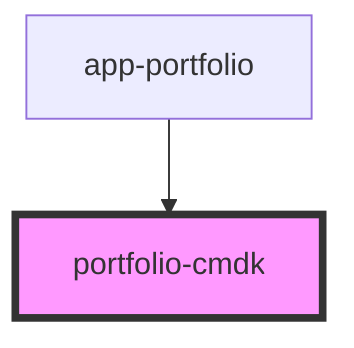

# portfolio-cmdk

<!-- Auto Generated Below -->

## Properties

| Property | Attribute | Description | Type           | Default |
| -------- | --------- | ----------- | -------------- | ------- |
| `lang`   | `lang`    |             | `"en" \| "pt"` | `'pt'`  |
| `open`   | `open`    |             | `boolean`      | `false` |

## Events

| Event       | Description | Type                               |
| ----------- | ----------- | ---------------------------------- |
| `cmdAction` |             | `CustomEvent<{ action: string; }>` |
| `cmdClose`  |             | `CustomEvent<void>`                |

## Dependencies

### Used by

 - [app-portfolio](../app-portfolio)

### Graph

----------------------------------------------

*Built with [StencilJS](https://stenciljs.com/)*
