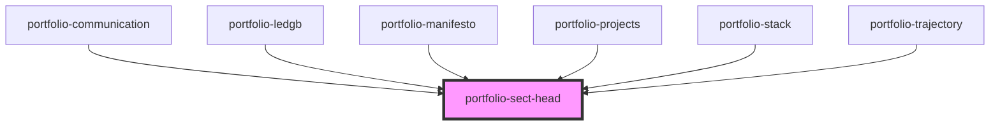

# portfolio-sect-head

<!-- Auto Generated Below -->

## Properties

| Property    | Attribute    | Description | Type     | Default |
| ----------- | ------------ | ----------- | -------- | ------- |
| `num`       | `num`        |             | `string` | `''`    |
| `sub`       | `sub`        |             | `string` | `''`    |
| `titleHtml` | `title-html` |             | `string` | `''`    |

## Dependencies

### Used by

 - [portfolio-communication](../portfolio-communication)
 - [portfolio-ledgb](../portfolio-ledgb)
 - [portfolio-manifesto](../portfolio-manifesto)
 - [portfolio-projects](../portfolio-projects)
 - [portfolio-stack](../portfolio-stack)
 - [portfolio-trajectory](../portfolio-trajectory)

### Graph

----------------------------------------------

*Built with [StencilJS](https://stenciljs.com/)*
