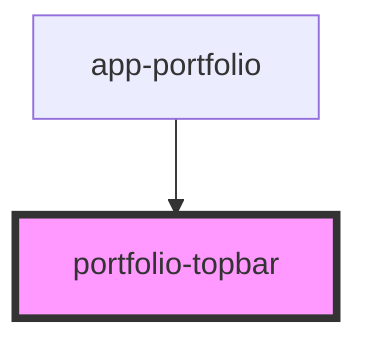

# portfolio-topbar

<!-- Auto Generated Below -->

## Properties

| Property | Attribute | Description | Type           | Default |
| -------- | --------- | ----------- | -------------- | ------- |
| `lang`   | `lang`    |             | `"en" \| "pt"` | `'pt'`  |

## Events

| Event  | Description | Type                |
| ------ | ----------- | ------------------- |
| `cmdK` |             | `CustomEvent<void>` |

## Dependencies

### Used by

 - [app-portfolio](../app-portfolio)

### Graph

----------------------------------------------

*Built with [StencilJS](https://stenciljs.com/)*
